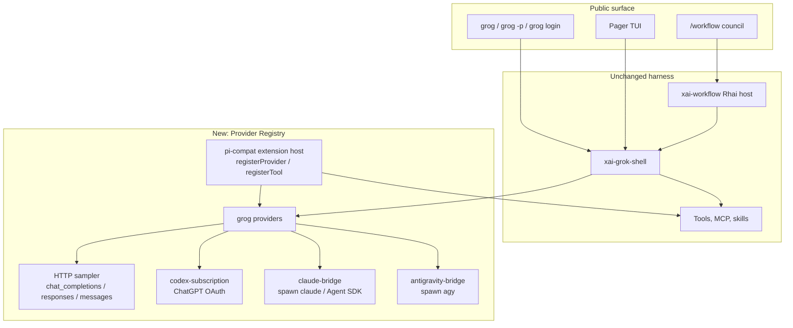

# Grog

Grog is this tree, forked into a multi-provider coding agent you launch with
`grog`. It keeps Grok Build's TUI, tools, sessions, plugins, MCP, subagents,
and Rhai workflows. It stops being an xAI-only client.

This is the build plan, not a completed fork. It is grounded in the code that
already exists in this repository.

## Goal

After the work lands:

```sh
grog                  # TUI
grog -p "fix the bug" # headless
grog login            # per-provider, not only xAI
```

A session can:

1. Drive **xAI Grok** with an API key (optional, not required).
2. Drive **ChatGPT Codex** with the user's **Codex / ChatGPT Plus–Pro
   subscription** (OAuth), not an OpenAI API key.
3. Drive **Claude** through a **Claude Code bridge** — the same shape as
   [`pi-claude-bridge`](https://www.npmjs.com/package/pi-claude-bridge): spawn
   the user's already-logged-in Claude Code CLI / Agent SDK. Not an Anthropic
   API subscription wired into grog.
4. Drive **Gemini** through an **Antigravity bridge** — the same shape as
   [`@estebanforge/pi-antigravity-bridge`](https://www.npmjs.com/package/@estebanforge/pi-antigravity-bridge):
   spawn Google's `agy` CLI. Not a Gemini Developer API key.
5. Load **pi-style provider + extension packages** (providers register models;
   extensions register tools such as `AskClaude` / `AskAntigravity` /
   `AskCodex`).
6. Run a **council workflow**: several model variants answer in parallel, then
   a chair synthesizes.

## What this repo already is

Grok Build is not a thin chat client. The pieces grog needs are mostly here:

| Piece | Where | What grog reuses |
| --- | --- | --- |
| CLI / TUI | `xai-grok-pager-bin` → artifact `xai-grok-pager`, shipped as `grok` | Keep the pager; change the public name |
| Agent runtime | `xai-grok-shell` | Leader, stdio, headless, tools |
| Inference | `xai-grok-sampler` | Streaming Chat Completions, Responses, Anthropic Messages |
| Custom HTTP models | `~/.grok/config.toml` `[model.*]` / `[model_providers.*]` | OpenAI-shaped and Anthropic-shaped HTTP. **Not** CLI bridges, **not** ChatGPT OAuth |
| Plugins | marketplace + `skills/`, `agents/`, `hooks/`, `.mcp.json` | Content packs. **Cannot register an inference backend** |
| MCP | stdio / HTTP / SSE | Tools, not models |
| Subagents | `spawn_subagent` + `[subagents.models]` | Parallel children; default inherit the parent model |
| Workflows | `xai-workflow` + `.grok/workflows/*.rhai` | `agent(prompt, #{ model, capability_mode, ... })` already takes a model id |
| Foreign sessions | Claude / Codex / Cursor resume | Import other agents' transcripts; not live inference |
| Auth | xAI OAuth, OIDC, `XAI_API_KEY`, `auth_provider_command` | One credential for the xAI gateway. No multi-provider wallet |

The gap versus pi is not "plugins" in general. It is **inference providers
and subscription/CLI bridges**. Pi extensions call `pi.registerProvider()` and
`pi.registerTool()`. Grok plugins cannot.

Do not rewrite the TUI or the tool loop. Add a provider layer, then rename
the public identity.

## Architecture



Three kinds of "provider" must stay distinct:

| Kind | Auth | How tokens arrive | Example |
| --- | --- | --- | --- |
| **HTTP sampler** | API key / env / existing `[model.*]` | Direct HTTP into `xai-grok-sampler` | Optional xAI, OpenRouter, Ollama |
| **Subscription OAuth** | User's consumer plan, inside grog | Native OAuth; refresh in `~/.grog/auth/` | **Codex** |
| **CLI bridge** | Whatever the *other* CLI already stored | Grog spawns that CLI; grog does not hold the vendor subscription | **Claude Code**, **Antigravity / agy** |

Claude and Gemini are bridges. Codex is a subscription. That split is
intentional.

## Phase 0 — Type `grog` to run it

Do **not** rename Rust crates (`xai-grok-shell`, …). That is thousands of
files of churn and fights the monorepo sync. Change **user-visible identity**
only.

### Binary

Today:

- Cargo artifact: `xai-grok-pager` (`crates/codegen/xai-grok-pager-bin`)
- Installer writes `BIN_DIR/grok` (and `agent`)
- Clap: `#[command(name = "grok")]` in `xai-grok-pager/src/app/cli.rs`
- `PagerArgs::parse_cli` only accepts argv0 `grok` or `agent`, else forces
  `"grok"`

Change:

1. Add a second `[[bin]]` named `grog` **or** have the installer symlink
   `grog` → the same artifact. Prefer a real `grog` bin name so `--help` and
   process listings match.
2. Teach `parse_cli` to accept argv0 `grog` (keep `grok` / `agent` as
   aliases during the transition).
3. Point `install.sh` / `install.ps1` at `grog`. Keep installing `grok` as a
   symlink for one release if local muscle memory matters.
4. Terminal title, `/help` about-text, version string: `grog`.

Local from-source:

```sh
cargo build -p xai-grok-pager-bin --release
install -m 755 target/release/xai-grok-pager "$HOME/.local/bin/grog"
# or, once the extra [[bin]] exists:
cargo install --path crates/codegen/xai-grok-pager-bin --bin grog
```

### Home, env, project dirs

Today everything lives under `~/.grok` (`xai-grok-home`, `$GROK_HOME`).

| Today | Grog | Notes |
| --- | --- | --- |
| `~/.grok` | `~/.grog` | Migrate: if `~/.grog` missing and `~/.grok` exists, copy or symlink once |
| `$GROK_HOME` | `$GROG_HOME` | Read both; `GROG_HOME` wins |
| `GROK_*` env | `GROG_*` | Accept both for one major version |
| `.grok/` in a repo | `.grog/` | Also read `.grok/` so existing project plugins/workflows keep working |
| `.grok-plugin/` | `.grog-plugin/` | Still accept `.grok-plugin/` and `.claude-plugin/` |
| macOS MDM `ai.x.grok` | leave it | Do not pretend to own xAI MDM |

`xai-grok-home` should grow `grog_home()` (or a renamed `app_home()`) that
resolves `GROG_HOME` → `GROK_HOME` → `~/.grog` → migrate-from-`~/.grok`.

### Prompt and product copy

System prompt currently says "You are Grok" /
"You are a Grok Build subagent." Change the **product** name in prompts to
Grog so the model does not claim to be xAI's Grok when the session is on
Claude or Codex. Keep "Grok" only as a **model family** label when the active
model is actually `grok-*`.

### Explicitly out of Phase 0

- Crate names, Bazel paths, `xai-` prefixes
- Telemetry endpoints (disable or make no-op; do not ship xAI telemetry as
  grog)
- Official xAI plugin marketplace URL (`github.com/xai-org/plugin-marketplace`)
  — stop auto-registering it; grog should start with an empty marketplace plus
  user-added sources

## Phase 1 — Provider registry (pi-shaped, Rust-native)

Pi's extension API is TypeScript (`pi.registerProvider`, `pi.registerTool`).
Grog is a Rust binary. **Do not embed pi** and do not pretend
`npm i pi-claude-bridge` will load inside the pager without a host.

Add a first-class **Provider** trait next to the sampler, owned by a new
crate (suggested: `grog-providers`) that `xai-grok-shell` calls instead of
assuming every model is an HTTP `ApiBackend`.

```rust
#[async_trait]
pub trait InferenceProvider: Send + Sync {
    fn id(&self) -> &str;           // "codex", "claude-bridge", "antigravity"
    fn display_name(&self) -> &str;
    fn models(&self) -> Vec<ProviderModel>;
    async fn ensure_auth(&self) -> Result<AuthStatus, ProviderError>;
    async fn stream(&self, req: CompletionRequest) -> Result<TokenStream, ProviderError>;
}
```

HTTP models stay: wrap today's `chat_completions` / `responses` / `messages`
sampler as the `http` provider. Custom `[model.*]` entries continue to work.

Discovery, in order:

1. Built-in providers (http, plus the three below once they land)
2. Native grog provider plugins (`~/.grog/providers/<id>/provider.toml` +
   optional binary)
3. Pi-compat packages (Phase 1b)

`/model` and `grog models` list `provider/model` ids, same as pi
(`claude-bridge/claude-opus-4-6`, `antigravity/gemini-3.6-flash`,
`codex/gpt-5.3-codex`).

Config sketch:

```toml
# ~/.grog/config.toml
[providers.http]
enabled = true

[providers.codex]
enabled = true          # ChatGPT subscription OAuth

[providers.claude-bridge]
enabled = true
command = "claude"      # user's Claude Code CLI
# grog never stores an Anthropic API key for this provider

[providers.antigravity]
enabled = true
command = "agy"         # Google Cloud Code Assist CLI

[models]
default = "codex/gpt-5.3-codex"
```

### Phase 1b — Pi extension host (optional, high leverage)

To actually `link in` npm packages the way pi does:

- Small Node host grog spawns (`grog-pi-host`), implementing a **subset** of
  pi's `ExtensionAPI`: `registerProvider`, `registerTool`, `on('session_start')`.
- Grog talks to it over stdio JSON-RPC.
- `grog plugin install npm:pi-claude-bridge` drops the package under
  `~/.grog/extensions/` and the host loads it.

This is how Claude bridge and Antigravity stay "just like the pi extension
package" without rewriting their TypeScript. Native Rust ports (Phases 3–4)
are the fallback if the host is too lossy (streaming, tool bridging, TUI
steering).

Ship the native bridges first if the host slips. Keep the npm install path
as the compatibility goal.

### Ask* tools

Pi bridges are two things: a **provider** (session runs *as* Claude / Gemini)
and an **Ask\*** tool (another model consults them). Grog needs both.

- Provider → `/model claude-bridge/…` runs the whole turn through the bridge.
- Tool → `AskClaude`, `AskAntigravity`, `AskCodex` registered when that
  bridge is enabled and the **active** provider is not that bridge (avoid
  recursion).

Council workflows use the Ask\* tools and/or `agent(..., #{ model })`.

## Phase 2 — Codex subscription

Wire ChatGPT Plus/Pro **Codex OAuth**, not `OPENAI_API_KEY`.

This is the one vendor grog should authenticate **itself**, because that is
how Codex-for-OSS works (same account ChatGPT / the Codex CLI uses). Pi calls
this `openai-codex`.

Implementation outline:

1. `grog login` becomes a **provider picker** (Codex, optional xAI, later
   others). `grog login codex` starts the ChatGPT OAuth / device-code flow
   Codex CLI uses.
2. Store tokens at `~/.grog/auth/codex.json` (0600). Do not reuse
   `~/.grok/auth.json` (that file is xAI session tokens).
3. New sampler backend **or** a dedicated provider that speaks the Codex
   Responses-shaped API with the ChatGPT access token, refresh, and account
   headers.
4. Catalog: the Codex models the subscription actually entitles (gpt-5.x
   Codex variants, whatever the account advertises). Refresh on login.
5. `AskCodex` tool for when the session is on another provider.

Reuse Grok's existing `auth_provider_command` only as an escape hatch, not as
the default Codex path. Users should not have to write a helper binary to use
a ChatGPT subscription.

Do **not** confuse this with `foreign_sessions` Codex resume. That already
imports `~/.codex` transcripts. Live inference is separate.

## Phase 3 — Claude bridge (not a Claude subscription)

Match `pi-claude-bridge`:

- Grog does **not** implement Anthropic OAuth or store `ANTHROPIC_API_KEY`
  for this provider.
- It spawns the user's **Claude Code** (`claude` CLI / `@anthropic-ai/claude-agent-sdk`).
- Auth is whatever `claude` already has in `~/.claude`.
- Streaming, tool calls, and steering stay in grog's TUI: the child must not
  open its own interactive UI.

Two implementation options, in preference order:

1. **Pi package via the Phase 1b host** — install `pi-claude-bridge` and
   shim `registerProvider` + `AskClaude`.
2. **Native port** — Rust provider that:
   - `claude -p --output-format stream-json` (or Agent SDK stdio)
   - Pipes grog's conversation + a tool-bridge MCP into the child
   - Decodes streamed events into sampler `TokenStream`
   - Forwards grog tools (except builtins / `AskClaude`) so Claude Code can
     edit the same workspace grog owns

MCP tool bridging is the hard part and is exactly why the pi package exists.
Budget it. A first slice can be "text-only consult" (`AskClaude`) before
full `/model claude-bridge/…` with tools.

Prerequisite: `claude` on `PATH` and a working `claude` login. `grog doctor`
should say so.

## Phase 4 — Antigravity bridge (Gemini)

Match `@estebanforge/pi-antigravity-bridge`:

- Spawn `agy` (Google Cloud Code Assist / Antigravity), not Generative
  Language API keys.
- Auth is the user's Google / `agy` login.
- Register `antigravity/gemini-*` (and whatever else that account
  advertises — the agy catalog can include Claude/GPT-OSS **through
  Google**, which is still the antigravity provider, not claude-bridge).
- Stream by the same mechanism the pi package uses (agy conversation DB /
  protobuf, or `agy -p` stdout — follow the package, do not invent a second
  protocol).
- `AskAntigravity` tool for one-shot Gemini consults.
- Optional: per-invocation MCP so `agy` can see grog tools without rewriting
  `~/.gemini/config/mcp_config.json`.

Prerequisite: `agy` on `PATH`. Document install (`agy` from Google Cloud
Code Assist). `grog doctor` checks it.

Antigravity advertising Claude models must **not** replace claude-bridge.
Same model name, different bill and tool surface. Keep provider prefixes.

## Phase 5 — Council workflows

The workflow engine already fans out agents. `deep_research.rhai` is the
template: `phase()`, parallel `agent()`, then a synthesizer. Subagents
default to the parent model; **workflow `agent()` takes `model`**. Use that.

Council is a saved workflow plus a few runtime rules, not a new engine.

### `~/.grog/workflows/council.rhai` (built-in)

```text
meta: name = council
phases: Brief → Deliberate → Rebut → Verdict
```

1. **Brief** — chair (current session model, or `council.chair`) writes a
   shared brief and a JSON schema for member answers.
2. **Deliberate** — `parallel` spawn of N members, each
   `agent(brief, #{ model, capability_mode: "read-only", label })`.
   Default slate from config, overridable per run:

   ```toml
   [council]
   chair = "codex/gpt-5.3-codex"
   members = [
     "codex/gpt-5.3-codex",
     "claude-bridge/claude-opus-4-6",
     "antigravity/gemini-3.6-flash",
     "http/grok-4.5",
   ]
   debate_rounds = 1
   ```

3. **Rebut** — optional second round: each member sees the others'
   answers (still read-only).
4. **Verdict** — chair synthesizes, with tools if the task is
   implementation. Only the chair writes the repo unless the user opted
   into `council.apply = true`.

Launch:

```text
/workflow council implement the cache invalidation
/council                    # slash alias
grog -p --workflow council "..."
```

### Runtime rules the current engine does not quite give us

| Need | Today | Change |
| --- | --- | --- |
| Mixed models in one workflow | `AgentOpts.model` exists | Honor it for bridged providers, not only HTTP ids |
| Parallelism | Rhai `parallel` + host spawn | Cap by `council.max_parallel` and token budget |
| Subagent depth | Children cannot spawn children | Keep it. Council members are workflow agents, not nested subagents |
| Cross-member context | Each agent is a fresh session | Pass prior answers as prompt text (already how deep-research shares claims) |
| Cost / fan-out | Easy to explode | Require an explicit `/council` (or workflow args) so the main agent cannot silently convene five frontier models |
| Failures | One member 401s | Mark that seat failed; chair proceeds with who answered |

### `/council` vs letting the main agent call Ask\*

Both. The workflow is the **deliberate, logged, budgeted** path. Ask\* is
the **opportunistic second opinion** during a normal session. Do not allow
AskClaude to call AskAntigravity to call AskCodex in a loop — each Ask\*
tool is disabled inside an Ask\* and inside council member sessions.

## Suggested file layout (new code)

```text
crates/codegen/grog-providers/     # trait, registry, http adapter
crates/codegen/grog-codex/         # ChatGPT OAuth + Codex API
crates/codegen/grog-claude-bridge/ # spawn claude / Agent SDK adapter
crates/codegen/grog-antigravity/   # spawn agy adapter
crates/codegen/grog-pi-host/       # optional Node host + JSON-RPC
crates/codegen/xai-grok-shell/src/session/workflows/council.rhai
docs/grog.md                       # this file
```

Installer / CLI identity edits stay in `xai-grok-pager`, `xai-grok-pager-bin`,
`xai-grok-home`.

## Build order

Work in this order so each slice is usable alone:

1. **Identity** — `grog` argv, `~/.grog`, env aliases, stop xAI marketplace
   auto-add, disable default telemetry. You can already use custom HTTP
   models.
2. **Provider registry + HTTP adapter** — `/model` lists `http/…` and
   existing `[model.*]` under a provider prefix. No behavior change for
   people who only use xAI keys.
3. **Codex subscription** — first non-HTTP provider; proves OAuth + catalog
   + AskCodex.
4. **AskClaude (text consult)** — smallest Claude-bridge slice; needs
   `claude` on PATH.
5. **AskAntigravity (text consult)** — same for `agy`.
6. **Full session bridges** — `/model claude-bridge/…` and
   `antigravity/…` with tool MCP bridging.
7. **Pi-compat host** — load the real npm packages if the native ports lag
   or to pick up their updates.
8. **Council workflow** — once at least two providers stream reliably.

## Doctor and UX

`grog doctor` should report, per provider:

- binary present (`claude`, `agy`)
- credential present / expired
- last successful probe
- whether Ask\* tools are armed

`grog login` lists providers. `grog logout [provider]` is scoped.

The model picker (`Ctrl+M`) groups by provider. Unavailable providers stay
visible but disabled, with the doctor reason.

## Risks

- **Pi packages are not drop-in.** They import `@mariozechner/pi-coding-agent`
  types and expect pi's TUI. A host that only implements `registerProvider` /
  `registerTool` will still miss events. Treat npm compatibility as best-effort;
  native bridges are the reliability path.
- **CLI bridges are slow and opaque.** Spawning Claude Code or agy is not an
  HTTP token stream. Timeouts, cancellation (`Esc`), and mid-turn steering
  need an explicit design in the provider trait (`abort`, `inject_user_message`).
- **Tool recursion / cost.** Ask\* + council + MCP-forwarded Ask\* is a
  spend bomb. Default deny nested Ask\*.
- **Auth confusion.** Three stores: grog Codex OAuth, `~/.claude`, `agy`
  Google login. Never copy those tokens into grog config.toml.
- **Monorepo sync.** This tree is periodically synced from SpaceXAI
  (`SOURCE_REV`). Keep grog-specific code in new crates and thin identity
  patches so future syncs rebase.
- **License / ToS.** Bridging Claude Code and agy uses those products' local
  CLIs under the user's existing accounts. Do not scrape hidden APIs when a
  supported CLI exists. Codex OAuth should follow the same protocol the
  official Codex CLI uses.

## First implementation slice (when coding starts)

The first PR after this plan should be boring and shippable:

1. `[[bin]] name = "grog"` (or install symlink) + clap argv0 `grog`.
2. `GROG_HOME` / `~/.grog` with fallback to `GROK_HOME` / `~/.grok`.
3. Product strings in clap, terminal title, and system prompt.
4. Installer copies/symlinks `grog`.

That is enough to type `grog` and keep using today's models. Providers,
bridges, and council are the next PRs, one provider at a time.
