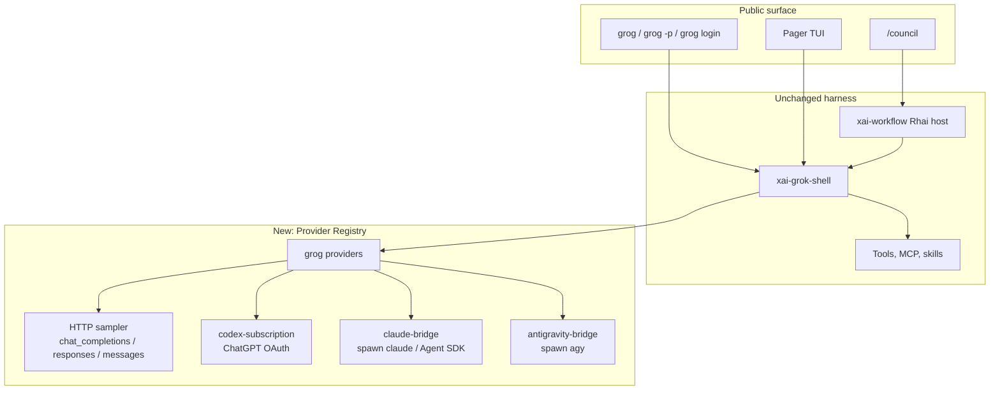

# Grog

Grog is this tree, forked into a multi-provider coding agent you launch with
`grog`. It keeps Grok Build's TUI, tools, sessions, plugins, MCP, subagents,
and Rhai workflows. It stops being an xAI-only client.

This is the build plan, grounded in the code that already exists in this
repository.

Native provider wiring is in the tree: `grog` launches the pager, `/model`
lists `claude-bridge/`, `antigravity/`, and `codex/` ids, Ask* tools consult
those backends, `/council` (and `/workflow council`) run a Karpathy-style
three-stage deliberation, and `grog doctor` /
`grog login [codex|claude|agy]` report PATH and Codex tokens. Home dir is
`$GROG_HOME` or `~/.grog` (legacy `~/.grok` still wins if it already exists).
Live `claude` / `agy` / Codex calls still require the user's own logins.

## Goal

After the work lands:

```sh
grog                  # TUI
grog -p "fix the bug" # headless
grog login            # per-provider, not only xAI
```

A session can:

1. Drive **xAI Grok** with an API key (optional, not required).
2. Drive **ChatGPT Codex** with the user's **Codex / ChatGPT Plus–Pro
   subscription** (OAuth), not an OpenAI API key.
3. Drive **Claude** through a **Claude Code bridge** — the same shape as
   [`pi-claude-bridge`](https://www.npmjs.com/package/pi-claude-bridge): spawn
   the user's already-logged-in Claude Code CLI / Agent SDK. Not an Anthropic
   API subscription wired into grog.
4. Drive **Gemini** through an **Antigravity bridge** — the same shape as
   [`@estebanforge/pi-antigravity-bridge`](https://www.npmjs.com/package/@estebanforge/pi-antigravity-bridge):
   spawn Google's `agy` CLI. Not a Gemini Developer API key.
5. Register **native grog providers and Ask\* tools** (same *shape* as the pi
   packages: a `/model` provider plus `AskClaude` / `AskAntigravity` /
   `AskCodex`). We study those packages and **reimplement them in Rust**. We
   do not load, wrap, or npm-install them.
6. Run a **council workflow**: several model variants answer in parallel, then
   a chair synthesizes.

## What this repo already is

Grok Build is not a thin chat client. The pieces grog needs are mostly here:

| Piece | Where | What grog reuses |
| --- | --- | --- |
| CLI / TUI | `xai-grok-pager-bin` → artifact `xai-grok-pager`, shipped as `grok` | Keep the pager; change the public name |
| Agent runtime | `xai-grok-shell` | Leader, stdio, headless, tools |
| Inference | `xai-grok-sampler` | Streaming Chat Completions, Responses, Anthropic Messages |
| Custom HTTP models | `~/.grok/config.toml` `[model.*]` / `[model_providers.*]` | OpenAI-shaped and Anthropic-shaped HTTP. **Not** CLI bridges, **not** ChatGPT OAuth |
| Plugins | marketplace + `skills/`, `agents/`, `hooks/`, `.mcp.json` | Content packs. **Cannot register an inference backend** |
| MCP | stdio / HTTP / SSE | Tools, not models |
| Subagents | `spawn_subagent` + `[subagents.models]` | Parallel children; default inherit the parent model |
| Workflows | `xai-workflow` + `.grok/workflows/*.rhai` | `agent(prompt, #{ model, capability_mode, ... })` already takes a model id |
| Foreign sessions | Claude / Codex / Cursor resume | Import other agents' transcripts; not live inference |
| Auth | xAI OAuth, OIDC, `XAI_API_KEY`, `auth_provider_command` | One credential for the xAI gateway. No multi-provider wallet |

The gap versus pi is not "plugins" in general. It is **inference providers
and subscription/CLI bridges**. Pi extensions call `pi.registerProvider()` and
`pi.registerTool()`. Grok plugins cannot. Grog grows that surface as **first-party
Rust crates**, using the pi packages as a protocol study, not as a runtime.

## Architecture



Three kinds of "provider" must stay distinct:

| Kind | Auth | How tokens arrive | Example |
| --- | --- | --- | --- |
| **HTTP sampler** | API key / env / existing `[model.*]` | Direct HTTP into `xai-grok-sampler` | Optional xAI, OpenRouter, Ollama |
| **Subscription OAuth** | User's consumer plan, inside grog | Native OAuth; refresh in `~/.grog/auth/` | **Codex** |
| **CLI bridge** | Whatever the *other* CLI already stored | Grog spawns that CLI; grog does not hold the vendor subscription | **Claude Code**, **Antigravity / agy** |

Claude and Gemini are bridges. Codex is a subscription. That split is
intentional.

## Phase 0 — Type `grog` to run it

Do **not** rename Rust crates (`xai-grok-shell`, …). That is thousands of
files of churn and fights the monorepo sync. Change **user-visible identity**
only.

### Binary

Today:

- Cargo artifact: `xai-grok-pager` (`crates/codegen/xai-grok-pager-bin`)
- Installer writes `BIN_DIR/grok` (and `agent`)
- Clap: `#[command(name = "grok")]` in `xai-grok-pager/src/app/cli.rs`
- `PagerArgs::parse_cli` only accepts argv0 `grok` or `agent`, else forces
  `"grok"`

Change:

1. Add a second `[[bin]]` named `grog` **or** have the installer symlink
   `grog` → the same artifact. Prefer a real `grog` bin name so `--help` and
   process listings match.
2. Teach `parse_cli` to accept argv0 `grog` (keep `grok` / `agent` as
   aliases during the transition).
3. Point `install.sh` / `install.ps1` at `grog`. Keep installing `grok` as a
   symlink for one release if local muscle memory matters.
4. Terminal title, `/help` about-text, version string: `grog`.
   `grog --version` prints `grog <version> (<commit>)`, not `grok …`.
5. **No x.ai/cli updater.** Grog is from-source. It must not show Grok Build
   “updated” / “update available” chrome, must not check x.ai/cli artifacts,
   and must not advertise grok upgrades. Official `grok` at `~/.grok` is a
   different binary and stays out of scope. `grog update` explains the
   from-source rebuild path instead of installing grok.

Local from-source:

```sh
cargo build -p xai-grok-pager-bin --release
install -m 755 target/release/xai-grok-pager "$HOME/.local/bin/grog"
# or, once the extra [[bin]] exists:
cargo install --path crates/codegen/xai-grok-pager-bin --bin grog
```

### Home, env, project dirs

Today everything lives under `~/.grok` (`xai-grok-home`, `$GROK_HOME`).

| Today | Grog | Notes |
| --- | --- | --- |
| `~/.grok` | `~/.grog` | Migrate: if `~/.grog` missing and `~/.grok` exists, copy or symlink once |
| `$GROK_HOME` | `$GROG_HOME` | Read both; `GROG_HOME` wins |
| `GROK_*` env | `GROG_*` | Accept both for one major version |
| `.grok/` in a repo | `.grog/` | Also read `.grok/` so existing project plugins/workflows keep working |
| `.grok-plugin/` | `.grog-plugin/` | Still accept `.grok-plugin/` and `.claude-plugin/` |
| macOS MDM `ai.x.grok` | leave it | Do not pretend to own xAI MDM |

`xai-grok-home` should grow `grog_home()` (or a renamed `app_home()`) that
resolves `GROG_HOME` → `GROK_HOME` → `~/.grog` → migrate-from-`~/.grok`.

### Prompt and product copy

System prompt currently says "You are Grog" (not "released by xAI"). Subagent
templates say Grog. Keep "Grok" only as a **model family** label when the active
model is actually `grok-*`. Override with `$GROG_SYSTEM_PROMPT_LABEL` (or the
legacy `$GROK_SYSTEM_PROMPT_LABEL`).

### Privacy (landed)

Grog does not ship xAI telemetry. Defaults:

- `[features] telemetry` off; xAI remote settings cannot turn it on
- Mixpanel / events URLs are not baked in (`GROK_TELEMETRY_BUILD_*` is ignored)
- Sentry uses only a runtime `SENTRY_DSN` (no compile-time DSN) and is opt-in
- Trace upload off unless the user sets it
- `/feedback` and the feedback trace card off; remote cannot enable them
- Official marketplace (`github.com/xai-org/plugin-marketplace`) is never
  auto-registered; start with an empty marketplace plus user-added sources

Opt-in remains via env (`GROG_TELEMETRY_ENABLED` / `GROK_TELEMETRY_ENABLED`,
`GROG_ERROR_REPORTING`) or local `config.toml`.

### Explicitly out of Phase 0

- Crate names, Bazel paths, `xai-` prefixes

## Phase 1 — Provider registry (pi-shaped, Rust-native)

Pi's extension API is TypeScript (`pi.registerProvider`, `pi.registerTool`).
Grog is a Rust binary. **Do not embed pi** and do not pretend
`npm i pi-claude-bridge` will load inside the pager without a host.

Add a first-class **Provider** trait next to the sampler, owned by a new
crate (suggested: `grog-providers`) that `xai-grok-shell` calls instead of
assuming every model is an HTTP `ApiBackend`.

```rust
#[async_trait]
pub trait InferenceProvider: Send + Sync {
    fn id(&self) -> &str;           // "codex", "claude-bridge", "antigravity"
    fn display_name(&self) -> &str;
    fn models(&self) -> Vec<ProviderModel>;
    async fn ensure_auth(&self) -> Result<AuthStatus, ProviderError>;
    async fn stream(&self, req: CompletionRequest) -> Result<TokenStream, ProviderError>;
}
```

HTTP models stay: wrap today's `chat_completions` / `responses` / `messages`
sampler as the `http` provider. Custom `[model.*]` entries continue to work.

Discovery, in order:

1. Built-in providers compiled into grog: `http`, `codex`, `claude-bridge`,
   `antigravity`
2. Optional later: native grog provider plugins (`~/.grog/providers/<id>/`)

There is **no** Node host and **no** `grog plugin install npm:…` path for
inference. Pi packages are reference material only.

`/model` and `grog models` list `provider/model` ids
(`claude-bridge/claude-opus-5`, `antigravity/gemini-3.7-flash-high`,
`codex/gpt-5.6-luna`). Defaults (Ask\* / council seats; older catalog
ids stay pickable):

| Seat | Catalog id | Thinking |
| --- | --- | --- |
| Codex | `codex/gpt-5.6-luna` | Responses `reasoning.effort` **xhigh** (Codex CLI: none/low/medium/high/**xhigh**/max) |
| Claude | `claude-bridge/claude-opus-5` | Claude Code `--effort medium` |
| agy | `antigravity/gemini-3.7-flash-high` | agy `--effort high` (agy only accepts low/medium/**high**; Flash slugs also bake `-low`/`-medium`/`-high`) |

Do not default council or AskCodex to `gpt-5.3-codex` — consumer ChatGPT
accounts reject that id (API-org accounts can still pick it from the
catalog). Do not default agy to `gemini-3.6-flash` or a medium thinking
slug. After login, prefer an id the Codex provider advertised
(`select_codex_model_id`) rather than a hardcoded forbidden id.

Config sketch:

```toml
# ~/.grog/config.toml
[providers.http]
enabled = true

[providers.codex]
enabled = true          # ChatGPT subscription OAuth

[providers.claude-bridge]
enabled = true
command = "claude"      # user's Claude Code CLI
# grog never stores an Anthropic API key for this provider

[providers.antigravity]
enabled = true
command = "agy"         # Google Cloud Code Assist CLI

[models]
default = "codex/gpt-5.6-luna"   # ChatGPT Plus/Pro Codex; not gpt-5.3-codex
```

### Ask* tools

Pi bridges are two things: a **provider** (session runs *as* Claude / Gemini)
and an **Ask\*** tool (another model consults them). Grog needs both.

- Provider → `/model claude-bridge/…` runs the whole turn through the bridge.
- Tool → `AskClaude`, `AskAntigravity`, `AskCodex` registered when that
  bridge is enabled and the **active** provider is not that bridge (avoid
  recursion).

Council workflows use the Ask\* tools and/or `agent(..., #{ model })`.

## What we learned from the pi packages (and will not wrap)

Those packages are the spec. Grog reimplements the **behavior** in Rust.
Shipping their TypeScript as a sidecar is out.

### Claude (`pi-claude-bridge` / Agent SDK)

- Two products in one crate: a **session provider** (`claude-bridge/<id>`)
  and an **AskClaude** tool (opt-in, disabled when that provider is already
  active).
- Auth is Claude Code's, not grog's. No Anthropic API key, no Claude Pro
  OAuth inside grog.
- The child is `claude` / Agent SDK in print mode. Stream
  `--output-format stream-json`. The child must not take over the TTY.
- Model ids are Claude Code ids with an optional `[1m]` suffix. Runtime
  context is measured, not copied from a catalog: Opus 4.7 is 1M bare; Opus
  4.8 needs `[1m]`; Opus 4.6 / Sonnet 4.6 `[1m]` depend on Max vs Extra
  Usage. Grog keeps that table in `grog-claude-bridge`.
- Tool loop stays in grog: expose grog tools over a **loopback MCP** the
  child is told about. Pair MCP `tools/call` with Claude's
  `_meta["claudecode/toolUseId"]` — call order is not the pairing key.
  Filter builtins and `AskClaude` so the child cannot recurse.
- `AskClaude` modes: `read` (default), `none`, `full`. Isolated sessions
  drop history. Thinking effort maps onto Claude Code's thinking flags.
- Mid-turn steering lands at the **next tool boundary**, not after the
  whole turn. Session rebuild after abort/`/compact` is expensive (cache
  break); prefer resume when history has not moved.

Native crate: spawn `claude`, parse stream-json, own the MCP server. Do not
depend on `@anthropic-ai/claude-agent-sdk` or the npm package.

### Antigravity (`@estebanforge/pi-antigravity-bridge`)

- Same dual shape: provider `antigravity/<slug>` plus `AskAntigravity`.
- Auth is `agy`'s Google login. Grog never sees the token. Spawn the
  **unmodified** `agy` binary (`AGY_BIN` override). Do not call Google's
  backend with reused OAuth — that is what got token-scrape tools banned.
- `agy -p` does not print a conversation id and does not stream tokens on
  stdout. The bridge snapshots `~/.gemini/antigravity-cli/conversations/*.db`
  (or `AGY_CONVERSATIONS_DIR`), diffs after spawn, and on collision reads
  `/proc/<pid>/fd` for the `.db` our child has open.
- Stream by polling SQLite every ~250ms. `PRAGMA data_version` first; only
  SELECT when it moved. Three trailing 100ms polls after exit; skip those
  on abort.
- `steps.step_payload` is unpublished protobuf. Hand-rolled walker, skip
  unknown fields:

  | Payload path | Meaning |
  | --- | --- |
  | field 20 → 1 | agent text |
  | field 5 → 4 → 2 or 9, 3 | tool name, input JSON |
  | field 30 → 4 | title |

  Step types in the DB (15 text, 14 thinking, 23 title, 5/7/8/9/17/21/33/101/132/138 tools). Status 3 = complete.
- `agy -p` cannot answer y/n. Full `/model` turns use `--dangerously-skip-permissions`
  with AcceptEdits so the child cannot hang on `run_command`. **AskAntigravity and
  council members use Plan mode** (the no-write escape) plus skip-permissions so
  `-p` still cannot hang. Do not combine `--sandbox` with skip-permissions.
- **Argv order:** Google's Go flag parser treats `-p`/`--print` as a
  value-taking flag (the next token is the prompt). Spawn **flags first**,
  then `-p` immediately followed by the user query:
  `agy --model <slug> --mode plan --dangerously-skip-permissions --effort high -p "<query>"`.
  Never put `--model` (or any other flag) after `-p` — agy will treat that
  flag as the prompt and never start the real question.
- MCP for grog tools: **per-invocation** config dir passed as extra
  `--add-dir`. Never write `~/.gemini/config/mcp_config.json`. Bind
  127.0.0.1 + a per-session `x-bridge-token`. AskAntigravity inner agy
  does **not** get that dir (recursion).
- Catalog comes from `agy models`. Keep a fallback list if discovery fails
  so the picker is not empty. Fallback ids match the dotted `agy --model`
  catalog (`gemini-3.7-flash-high`, `gemini-3.6-flash-high`, …), not the
  pi slugify form (`gemini-3-7-flash-high`).
- **Thinking:** agy exposes `--effort low|medium|high` (no xhigh/max).
  Flash models also bake effort into the slug. AskAntigravity and council
  use **`gemini-3.7-flash-high`** plus **`--effort high`** (the max agy
  supports), still in **Plan** mode. `--effort` is a flag and must precede
  `-p`.

Native crate: spawn, discover DB, decode protobuf, poll. rusqlite in grog,
not Node's `node:sqlite`.

### Codex (ChatGPT subscription)

Pi's built-in `openai-codex` is the reference, not an npm bridge.

- OAuth against `auth.openai.com` (PKCE browser or device code at
  `/codex/device`). Client id is the public Codex CLI id. Refresh at
  `/oauth/token`. `ChatGPT-Account-Id` comes from the JWT
  `https://api.openai.com/auth` claim.
- Prefer reading `~/.codex/auth.json` when the user already ran `codex login`,
  then copy/refresh into `~/.grog/auth/codex.json`. Do not invent a second
  login if Codex CLI is already signed in.
- Inference is the ChatGPT Codex backend (`chatgpt.com/backend-api` /
  Responses-shaped), **not** `api.openai.com` with `OPENAI_API_KEY`.
- `AskCodex` for consults from another provider.

## Phase 2 — Codex subscription

Wire ChatGPT Plus/Pro **Codex OAuth**, not `OPENAI_API_KEY`.

1. `grog login` is a provider picker. `grog login codex` uses device-code
   or browser PKCE, or imports `~/.codex/auth.json`.
2. Store tokens at `~/.grog/auth/codex.json` (0600).
3. Provider speaks the Codex backend with the ChatGPT access token,
   refresh, and account headers.
4. Catalog = what the subscription advertises. Refresh on login.
5. `AskCodex` when the session is on another provider.

Do **not** confuse this with `foreign_sessions` Codex resume. That already
imports `~/.codex` transcripts. Live inference is separate.

## Phase 3 — Native Claude bridge

Crate `grog-claude-bridge`. Behavior above. First slice: `AskClaude` text
consult (`read` mode, no MCP). Second: full `/model claude-bridge/…` with
loopback MCP and stream-json. Prerequisite: `claude` on `PATH`.

## Phase 4 — Native Antigravity bridge

Crate `grog-antigravity`. Behavior above. First slice: protobuf decoder +
`AskAntigravity` after `agy -p` exits (easier than live poll). Second:
250ms poll streaming + `/model antigravity/…`. Prerequisite: `agy` on
`PATH`.

## Phase 5 — Council workflows (Karpathy)

The workflow engine already fans out agents. Council is a saved workflow plus
a few runtime rules, not a new engine. The deliberation matches
[Karpathy's llm-council](https://github.com/karpathy/llm-council):

1. **Opinions** — every member answers the user query independently, in parallel.
2. **Review** — every successful member ranks **anonymized** copies (`Response A/B/C`).
   Identities are hidden so models cannot play favorites. Each ranking must end
   with `FINAL RANKING:` and a numbered list.
3. **Verdict** — the chair sees **named** Stage 1 answers plus Stage 2 rankings
   (and the A→model key) and writes one final answer.

Failed seats are noted; the chair continues with whoever answered. Nested
Ask*/council recursion is denied. Members run **read-only isolated Ask**
(Claude: Read/Glob/Grep/Web only; agy: **Plan** mode; Codex: text consult).
Only the chair may write, and only if `args.apply == true`.

Default members: `claude-bridge/claude-opus-5` (medium thinking),
`antigravity/gemini-3.7-flash-high` (`--effort high`, Plan mode),
`codex/gpt-5.6-luna` (`reasoning.effort` xhigh). Override with
`args.members`, `args.chair`. Codex defaults to `gpt-5.6-luna` because
ChatGPT Plus/Pro Codex subscriptions reject `gpt-5.3-codex`.

When it works, `/council` returns a visible product: the independent
answers, a ranking stage **when more than one seat answered**, and a chair
synthesis. If only one seat starts (degraded membership), review is skipped
but the report still includes that seat's answer plus the chair note — never
a null report.

```text
/council implement the cache invalidation
/workflow council {"query":"...", "members":["codex/gpt-5.6-luna"], "apply": false}
grog -p --workflow council "..."
```

`/council` is a first-class slash alias (same gate as `/deep-research`).

### Runtime rules the current engine does not quite give us

| Need | Today | Change |
| --- | --- | --- |
| Mixed models in one workflow | Landed — native ids go through grog-providers | |
| Parallelism | Rhai `parallel` + host spawn | Optional later: cap by `council.max_parallel` |
| Subagent depth | Children cannot spawn children | Keep it. Council members are workflow agents, not nested subagents |
| Cross-member context | Landed — Stage 2 is anonymized Response A/B/C; chair sees names | |
| Cost / fan-out | Landed — `/council` is explicit | |
| Failures | Landed — failed seats noted; chair proceeds | |

### `/council` vs letting the main agent call Ask\*

Both. The workflow is the **deliberate, logged, budgeted** path. Ask\* is
the **opportunistic second opinion** during a normal session. Do not allow
AskClaude to call AskAntigravity to call AskCodex in a loop — each Ask\*
tool is disabled inside an Ask\* and inside council member sessions.

## Suggested file layout (new code)

```text
crates/codegen/grog-providers/     # trait, registry, model-id parsing
crates/codegen/grog-codex/         # ChatGPT OAuth + Codex backend
crates/codegen/grog-claude-bridge/ # native claude spawn + stream-json + AskClaude
crates/codegen/grog-antigravity/   # native agy spawn + sqlite poll + protobuf + AskAntigravity
crates/codegen/xai-grok-shell/src/session/workflows/council.rhai
docs/grog.md                       # this file
```

No `grog-pi-host`. No npm dependency.

Installer / CLI identity edits stay in `xai-grok-pager`, `xai-grok-pager-bin`,
`xai-grok-home`.

## Build order

Work in this order so each slice is usable alone:

1. **Identity** — `grog` argv, `~/.grog`, env aliases, no xAI marketplace
   auto-add, telemetry off by default. You can already use custom HTTP
   models. **Landed.**
2. **Provider registry + HTTP adapter** — `/model` lists `http/…` and
   existing `[model.*]` under a provider prefix. No behavior change for
   people who only use xAI keys.
3. **Codex subscription** — first non-HTTP provider; proves OAuth + catalog
   + AskCodex.
4. **AskClaude (text consult)** — smallest Claude-bridge slice; needs
   `claude` on PATH.
5. **AskAntigravity (text consult)** — same for `agy`.
6. **Full session bridges** — `/model claude-bridge/…` and
   `antigravity/…` with loopback MCP (Claude) and per-invocation agy
   `--add-dir` MCP (Antigravity).
7. **Council workflow** — Karpathy Opinions → anonymous Review → chair Verdict. **Landed.**

## Doctor and UX

`grog doctor` should report, per provider:

- binary present (`claude`, `agy`)
- credential present / expired
- last successful probe
- whether Ask\* tools are armed

`grog login` lists providers. `grog logout [provider]` is scoped.

The model picker (`Ctrl+M`) groups by provider. Unavailable providers stay
visible but disabled, with the doctor reason.

## Risks

- **Do not wrap the npm packages.** They target pi's TypeScript
  `ExtensionAPI`. Reimplementing the protocol in Rust is the product.
- **CLI bridges are slow and opaque.** Spawning Claude Code or agy is not an
  HTTP token stream. Timeouts, cancellation (`Esc`), and mid-turn steering
  need an explicit design in the provider trait (`abort`, `inject_user_message`).
- **Tool recursion / cost.** Ask\* + council + MCP-forwarded Ask\* is a
  spend bomb. Default deny nested Ask\*.
- **Auth confusion.** Three stores: grog Codex OAuth, `~/.claude`, `agy`
  Google login. Never copy those tokens into grog config.toml.
- **Monorepo sync.** This tree is periodically synced from SpaceXAI
  (`SOURCE_REV`). Keep grog-specific code in new crates and thin identity
  patches so future syncs rebase.
- **License / ToS.** Bridging Claude Code and agy uses those products' local
  CLIs under the user's existing accounts. Do not scrape hidden APIs when a
  supported CLI exists. Codex OAuth follows the same protocol the official
  Codex CLI uses (public client id, `chatgpt.com/backend-api`, import of
  `~/.codex/auth.json`). The HTTP `originator` header is `grog` on purpose —
  grog does not impersonate `codex_cli_rs`.

## First implementation slice

Landed in this tree as native crates plus a `grog` binary name, provider
wiring, Karpathy council (`/council`), Grog identity in prompts, and
privacy-max telemetry defaults. Rebase notes: [UPSTREAM.md](UPSTREAM.md).
